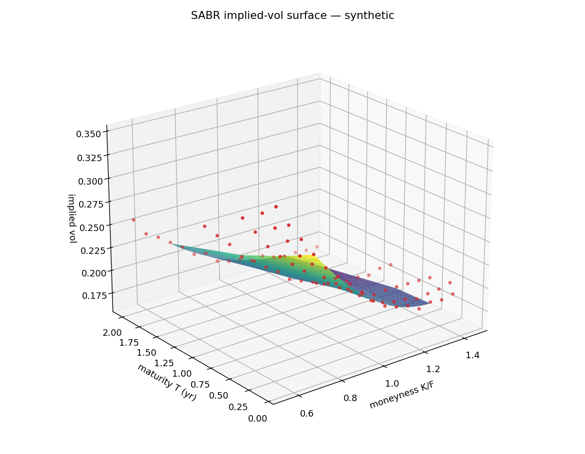
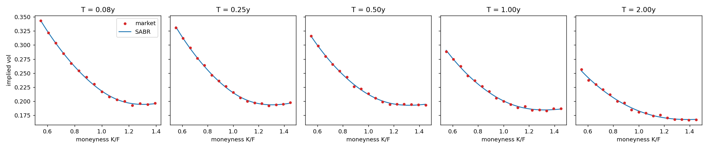
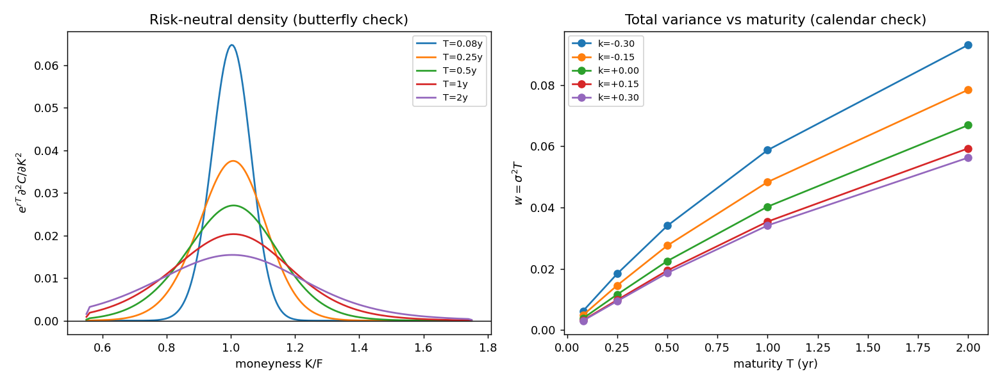

# Quantitative Implied Volatility Surface & SABR Smile Calibration Engine


An end-to-end quantitative pricing and volatility modeling pipeline that transforms discrete, noisy option quotes into a smooth, arbitrage-free continuous **3D Implied Volatility Surface**.

The pipeline executes three core quantitative steps:
1. **Robust Inversion:** Inverts Black-Scholes option prices into implied volatilities via safeguarded Newton-Raphson hybrid solvers.
2. **SABR Smile Calibration:** Fits Hagan’s lognormal SABR asymptotic expansion $(\alpha, \beta, \rho, \nu)$ across individual option expiry tenors.
3. **Arbitrage-Free Surface Interpolation:** Audits and enforces Breeden-Litzenberger butterfly no-arbitrage constraints and calendar variance monotonicity before generating a continuous 3D surface.

---

## 🌐 Interactive 3D Volatility Surface Showcase

Because GitHub Markdown strips live Javascript scripts for security reasons, the standalone interactive 3D surface is packaged as `vol_surface_animated.html`. You can interactively rotate, zoom, slice by tenor, and animate the term structure using either option below:

### Option 1: Launch Online Interactive Viewer (Click Badge)
Click the button below to render the full rotating 3D Plotly animation directly in your web browser via HTMLPreview:

[](https://htmlpreview.github.io/?https://github.com/K-Jyotiraditya/Volatility-_-/blob/main/vol_surface_animated.html)

### Option 2: Local Execution
Clone the repository and open the generated HTML file in any browser (Chrome, Firefox, Edge):
```bash
python animate_surface.py SPY
# Double-click vol_surface_animated.html to open in your browser
```

---

## 📊 Static Visual Diagnostics & Calibration Audits

### 1. 3D Implied Volatility Surface & Quote Overlays
Continuous 3D volatility surface $(\sigma \text{ vs. Moneyness } K/F \text{ vs. Maturity } T)$ generated by interpolating fitted SABR parameters. Empirical option quotes are overlaid as scatter markers.



### 2. Per-Tenor SABR Smile Fits
Individual volatility smile slices demonstrating Hagan's SABR model capturing negative equity skew (downside put premium) and out-of-the-money wing curvature across maturity tenors.



### 3. Static Arbitrage Diagnostics (Butterfly & Calendar Audits)
Audits the fitted surface against static arbitrage bounds:
* **Butterfly Arbitrage Check:** Ensures risk-neutral density $e^{rT} \frac{\partial^2 C}{\partial K^2} \ge 0$.
* **Calendar Arbitrage Check:** Ensures total variance $w(K, T) = \sigma^2 T$ is strictly non-decreasing across time.



---

## ⚙️ System Architecture & Codebase Overview

| Module | Core Functionality |
| :--- | :--- |
| [`black_scholes.py`](black_scholes.py) | Black-Scholes-Merton pricing equations, vega sensitivities, and analytic no-arbitrage price boundaries. |
| [`implied_vol.py`](implied_vol.py) | Safeguarded Newton-Raphson (`rtsafe`) solver combined with Brent bisection fallback for deep OTM wing stability. |
| [`sabr.py`](sabr.py) | Hagan's lognormal SABR asymptotic approximation and least-squares parameter estimation per tenor. |
| [`arbitrage.py`](arbitrage.py) | Static arbitrage diagnostics (Breeden-Litzenberger density & calendar variance) and penalized calibration routines. |
| [`market_data.py`](market_data.py) | Reproducible synthetic SABR chain generator and live Yahoo Finance (`yfinance`) options chain extractor. |
| [`animate_surface.py`](animate_surface.py) | Plotly engine generating self-contained interactive 3D HTML animations (`vol_surface_animated.html`). |
| [`main.py`](main.py) | Master pipeline orchestrator generating diagnostic visual assets (`vol_surface.png`, `sabr_smiles.png`). |
| [`test_vol.py`](test_vol.py) | Automated unit test suite validating inversion precision, parameter recovery, and arbitrage constraints. |

---

## 🚀 Quickstart & Usage

### Prerequisites
Make sure Python 3.9+ is installed along with the required scientific computing stack:
```bash
pip install numpy scipy pandas matplotlib plotly yfinance pytest
```

### Run Pipeline (Synthetic or Live Market)
Generate the volatility surface and static diagnostic charts:
```bash
# Run on reproducible synthetic SABR chain
python main.py

# Or fetch live option chains from Yahoo Finance
python main.py SPY
```

### Generate Interactive 3D Animation
Create the standalone interactive HTML file:
```bash
python animate_surface.py SPY
```

### Run Offline Quantitative Tests
Execute rigorous round-trip precision and arbitrage verification tests:
```bash
python -m pytest -q
```

---

## 💡 Quantitative & Numerical Design Highlights

* **Step-in-$\sigma$ Convergence Criterion:** Deep out-of-the-money wing options can trade at dollar premiums near $10^{-10}$. Standard price residual convergence tolerances falsely terminate at initial guesses. Our numerical root-finder monitors $\Delta \sigma$ directly, guaranteeing precision across all strikes.
* **Parameter Space Interpolation:** Directly interpolating grid volatilities $\sigma(K, T)$ introduces severe static calendar and butterfly arbitrage. This engine interpolates smooth SABR parameters $(\alpha_T, \rho_T, \nu_T)$ across maturity space before evaluating Hagan's expansion.

For formal derivations of Hagan's SABR expansion, Breeden-Litzenberger state prices, and numerical root-finding stability proofs, read [`THEORY.md`](THEORY.md).
